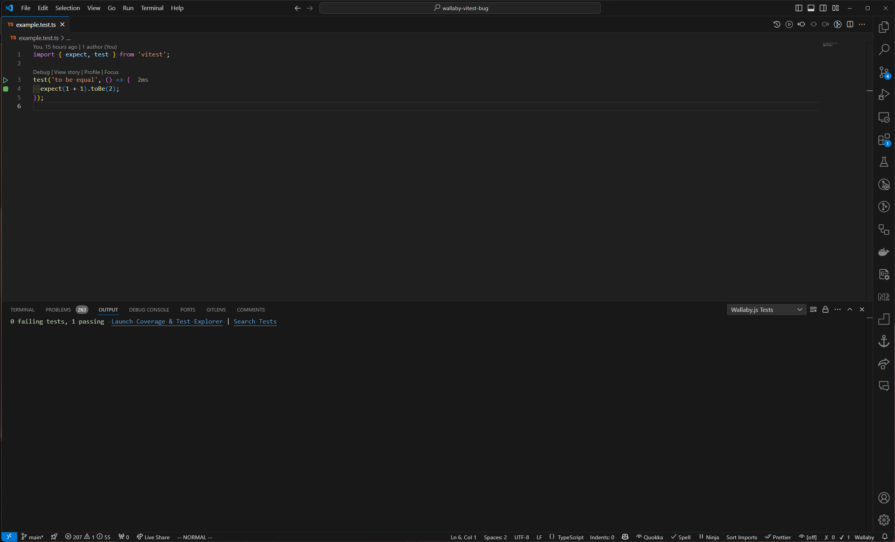

[fixed](https://github.com/wallabyjs/public/issues/3399)

# Description

Wallaby working not correct when use `Automatic Configuration <project directory>` with vitest@2.1.2.

In contrast with vitest@2.0.5 working everything alright.

## Steps to reproduce

- clone project

```bash
git clone https://github.com/VSymonenko/wallaby-vitest-bug.git
```

- move to project directory

```bash
cd wallaby-vitest-bug
```

- install dependencies

```bash
npm i
```

- check working example test with vitest

```bash
npm run test
```

- run wallaby with vscode command palette `>wallaby.js: start`

## Actual Result

Wallaby missing test file `example.test.ts`


## Expected result

Wallaby execute test file `example.test.ts`



## Environment

```bash
npm version 
{
  'wallaby-vitest-bug': '1.0.0',
  npm: '10.8.2',
  node: '20.18.0',
  acorn: '8.12.1',
  ada: '2.9.0',
  ares: '1.33.1',
  base64: '0.5.2',
  brotli: '1.1.0',
  cjs_module_lexer: '1.4.1',
  cldr: '45.0',
  icu: '75.1',
  llhttp: '8.1.2',
  modules: '115',
  napi: '9',
  nghttp2: '1.61.0',
  nghttp3: '0.7.0',
  ngtcp2: '1.1.0',
  openssl: '3.0.13+quic',
  simdutf: '5.5.0',
  tz: '2024a',
  undici: '6.19.8',
  unicode: '15.1',
  uv: '1.46.0',
  uvwasi: '0.0.21',
  v8: '11.3.244.8-node.23',
  zlib: '1.3.0.1-motley-71660e1'
}
```

## [Wallaby diagnostic report](./wallaby-diagnostic-report.txt)